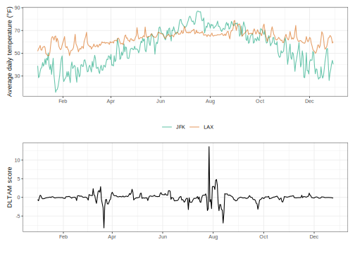

<!-- README.md is generated from README.Rmd. Please edit that file -->

# dltam

<!-- badges: start -->

<!-- badges: end -->

This package implements the calculation of the dynamic local trend
association measure (DLTAM) for a pair of time series, proposed by
García-López, F. J., Batyrshin, I., and Gelbukh, A., in the paper
[“Dynamic Local Trend Associations in Analysis of Comovements of
Financial Time Series”](https://doi.org/10.1007/978-3-319-67137-6_20).

## Installation

You can install this package using:

``` r
# install.packages("remotes")
remotes::install_github("adamoshen/dltam")
```

## Basic usage

``` r
library(tidyverse)
library(patchwork)
library(loco)
library(dltam)
```

Suppose we are interested in the DLTAM of average daily temperature
readings at JFK and LAX airports. This data can be found in the
[loco](https://github.com/adamoshen/loco) package. A quick preview of
the data:

``` r
daily_temperature %>%
  group_by(origin) %>%
  slice_head(n = 6) %>%
  group_split()
#> <list_of<
#>   tbl_df<
#>     origin: character
#>     date  : date
#>     temp  : double
#>   >
#> >[2]>
#> [[1]]
#> # A tibble: 6 × 3
#>   origin date        temp
#>   <chr>  <date>     <dbl>
#> 1 JFK    2013-01-01  38.9
#> 2 JFK    2013-01-02  28.5
#> 3 JFK    2013-01-03  29.8
#> 4 JFK    2013-01-04  34.0
#> 5 JFK    2013-01-05  36.9
#> 6 JFK    2013-01-06  37.4
#> 
#> [[2]]
#> # A tibble: 6 × 3
#>   origin date        temp
#>   <chr>  <date>     <dbl>
#> 1 LAX    2013-01-01  51.8
#> 2 LAX    2013-01-02  54.0
#> 3 LAX    2013-01-03  55.0
#> 4 LAX    2013-01-04  56.9
#> 5 LAX    2013-01-05  52.9
#> 6 LAX    2013-01-06  52.7
```

First, we require a data frame containing the two time series’ data as
columns.

``` r
daily_temperature_wide <- daily_temperature %>%
  pivot_wider(id_cols=date, names_from=origin, values_from=temp)

daily_temperature_wide
#> # A tibble: 364 × 3
#>    date         JFK   LAX
#>    <date>     <dbl> <dbl>
#>  1 2013-01-01  38.9  51.8
#>  2 2013-01-02  28.5  54.0
#>  3 2013-01-03  29.8  55.0
#>  4 2013-01-04  34.0  56.9
#>  5 2013-01-05  36.9  52.9
#>  6 2013-01-06  37.4  52.7
#>  7 2013-01-07  41.9  55.2
#>  8 2013-01-08  38.7  55.3
#>  9 2013-01-09  40.8  56.1
#> 10 2013-01-10  45.0  55.0
#> # ℹ 354 more rows
```

The DLTAM scores can be obtained by passing `daily_temperature_wide` to
`dltam::dltam()`. We set the window size to 5 and the Moving
Approximation Transform sequence size to 3.

``` r
dltam_scores <- daily_temperature_wide %>%
  dltam(JFK, LAX, timestamp=date, window_size=5, mat_seq_size=3)

dltam_scores
#> # A tibble: 358 × 2
#>    timestamp    score
#>    <date>       <dbl>
#>  1 2013-01-01 -0.589 
#>  2 2013-01-02 -0.904 
#>  3 2013-01-03 -0.0404
#>  4 2013-01-04  0.577 
#>  5 2013-01-05  0.375 
#>  6 2013-01-06 -0.200 
#>  7 2013-01-07 -0.389 
#>  8 2013-01-08 -0.350 
#>  9 2013-01-09 -0.335 
#> 10 2013-01-10 -0.202 
#> # ℹ 348 more rows
```

We can now plot the DLTAM scores and identify time points of particular
interest.

``` r
p1 <- ggplot(daily_temperature) +
  geom_line(aes(x=date, y=temp, colour=origin), alpha=0.6) +
  scale_colour_manual(values = c("#009E73", "#D55E00")) +
  scale_x_date(date_breaks="2 months", date_labels="%b") +
  labs(x="", y="Average daily temperature (°F)", colour="") +
  theme_bw(base_size = 9) +
  theme(legend.position = "bottom")

p2 <- ggplot(dltam_scores) +
  geom_line(aes(x=timestamp, y=score), colour="black") +
  scale_x_date(date_breaks="2 months", date_labels="%b") +
  labs(x="", y="DLTAM score") +
  theme_bw(base_size = 9)

p1 / p2
```


